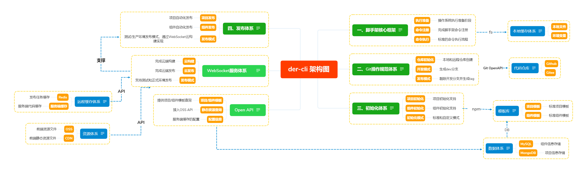

# der-cli 架构图

## 脚手架核心框架

- [x] 执行准备
- [ ] 命令注册
- [ ] 命令执行

### 本地缓存体系

- [ ] 本地文件&环境变量（配置信息等）

## Git操作规范体系

- [ ] 仓库初始化（本地 / 远程）
- [ ] 开发模式（dev分支同步）
- [ ] 发布模式（branch / tag）

### 代码仓库

- [x] Github
- [x] Gitee

## 初始化体系

> 依赖Open API

- [ ] 项目初始化
- [ ] 组件初始化
- [ ] 初始化模式（自定义 / 标准）

### 模板库-NPM

- [x] 项目模板
- [x] 组件模板

## 发布体系

> WebSocket服务体系

- [ ] 项目发布
- [ ] 组件发布
- [ ] 发布模式（测试/生产环境发布模式，通过WebSocket云构建实现）

## Open API

- [ ] 项目/组件模板
- [ ] 静态资源查询
- [ ] 配置信息

### 数据体系

- [ ] MySQL - 组件模板信息
- [ ] MongoDB - 项目模板信息

## WebSocket服务体系

- [ ] 云构建
- [ ] 云发布
- [ ] 发布模式

### 远程缓存体系-云构建

- [ ] Redis
- [ ] 服务端缓存

### 资源体系-云发布

- [ ] OSS
- [ ] CDN

# der-cli 模块化策略

### 拆分原则

- 核心模块：core
- 命令模块：commands
- 模型模块：models
- 工具模块：utils

### 细节

- 核心流程 `core`
- 命令 `commands`
  - [x] 初始化
  - [x] 发布
  - [ ] 清除缓存
- 模型层 `models`
  - [x] Command 命令
  - [x] Project 项目
  - [x] Component 组件
  - [x] Npm 模块
  - [x] Git 仓库
- 支撑模块 `utils`
  - [x] Git 操作
  - [x] 云构建
  - [x] 工具方法
  - [x] API 请求

### Core模块

#### 命令执行流程

- 准备阶段
- 命令注册
- 命令执行

### Commands模块

#### init

### Models模块

> 通用模块

关键词：

- 高性能：基于**缓存**与**Node多进程**实现动态命令加载和执行
- 可扩展：Class编程

#### 通用Package Class

#### 通用Command Class

